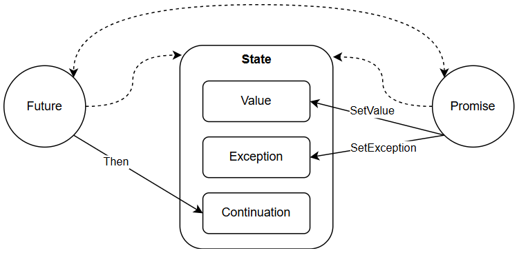

# NFuture

## 1. 背景

异步编程在程序开发中逐渐成为一种常态。相比同步编程，它更加难开发、难理解、难维护。

传统的异步编程，就是采用最朴素的回调函数实现，或者通过“状态设计模式”进行一些封装。这很难避免几个问题：代码逻辑割裂，状态恢复困难。

Promise/Future作为一种新的异步编程机制，较好地解决了上述问题。

## 2. 原理简介

Promise和Future成对出现，当异步操作完成后，通过Promise设置操作结果，并在Future注册回调得到结果。

Promise核心接口：
- `SetValue`：当操作正常结束后，设置操作结果；
- `SetException`：当操作异常结束后，设置异常原因。

Future核心接口：
- `Then`：注册回调Continuation，获取结果。

Promise设置结果和Future注册回调，两者的执行时机没有先后限制。只有两者都执行后，才会最终触发回调。



这样设计的好处有：
- 设置结果和注册回调两个动作解耦，给用户带来更自由的控制；
- 利用C++模板和lambda机制，Continuation是一个泛型回调，可同时携带值和动作。
- Future作为一个标准化的值容器，可结合标准化的执行流工具，自由组合出复杂的流程。

## 3. 使用示例

例如，实现一个“从多路取数据”的异步函数`MultiGetAsync`。

采用传统回调实现如下，我们需要构造一个上下文来存储全局状态，也即`struct Context`：
```cpp
void GetAsync(Input& input, std::function<void(Output&)>) {}

struct Context {
  std::vector<Output> outputs;
  size_t remaining;
};

void MultiGetAsync(std::vector<Input>&& inputs, std::function<void(std::vector<Output>&)> done) {
  auto context = std::make_shared<Context>();
  context->remaining = inputs.size();
  for (auto& input : inputs) {
    GetAsync(input, [=](Output& output) {
      context->outputs.push_back(output);
      if (--context->remaining == 0) {
        done(context->outputs);
      }
    });
  }
}
```

作为对比，采用Promise/Future实现如下，其中关键利用了`WhenAll`这个标准化的执行流工具：
```cpp
Future<Output> GetAsync(Input& input) {}

Future<std::vector<Future<Output>>> MultiGetAsync(std::vector<Input>&& inputs) {
  std::vector<Future<Output>> futures;
  for (auto& input : inputs) {
    futures.push_back(GetAsync(input));
  }
  return WhenAll(futures.begin(), futures.end());
}
```

可以看出，Promise/Future相比传统回调表达能力更强大，代码更加简洁直观。

## 4. 设计理念

C++11中支持了[Futures](https://en.cppreference.com/w/cpp/thread/future)。
不过它的定位更偏向于线程间的传值工具，而非异步编程工具。例如`std::future`没有支持`then`接口，导致无法表达回调逻辑。

tRPC-Cpp也提供了[Future](https://git.woa.com/trpc-cpp/trpc-cpp/tree/master/trpc/common/future)作为异步编程工具。
不过设计和实现存在几个问题：
- 核心接口依赖`std::mutex`，影响性能；
- 核心数据结构依赖`std::shared_ptr`，引发较多内存申请释放、原子操作等，影响性能；
- 在Promise和Future跨线程使用时，其Continuation运行线程无法确定，可能引发逻辑混乱和错误，而且比较隐晦；
- 提供了阻塞接口`Future::Wait`，用户容易误用，导致线程阻塞。

为了解决上述问题，NFuture的设计理念如下：
- Promise和Future始终运行在相同的线程，从而消除Continuation运行时机的不确定性，也无需加锁；
- 除了Continuation采用裸指针管理外，不再有内存分配，部分场景做到零开销；
- 提供丰富的Future执行流工具。

## 5. 接口介绍

### 5.1. 构造Promise/Future

Promise/Future为模板类，支持多值和空值。不支持`void`类型的值，可用`Future<>`代替`Future<void>`，Promise同理。构造Promise和Future对象可以直接调用其构造函数：

```cpp
template <class... T>
class Promise {
  Promise();
  Promise(Promise&& other);
  Promise& operator=(Promise&& other);
};

template <class... T>
class Future {
  Future();
  Future(Future&& other);
  Future& operator=(Future&& other);
};
```

Promise和Future一般成对使用，通过其中一个对象，可以生成其关联的另一个对象，通过如下接口：

```cpp
template <class... T>
class Promise {
  Future<T...> GetFuture();
};

template <class... T>
class Future {
  Promise<T...> GetPromise();
};
```

Future代表一个未来的结果（期待值，模板参数T...），未来有两种最终状态：Ready和Failed。Ready表示期待值已经生成；Failed表示期待值无法生成，并包含一个异常表明原因。两者统称为Available状态，或者完成状态。用户可使用如下接口构造完成状态的Future对象：

```cpp
template <typename... T, typename... U>
Future<T...> MakeReadyFuture(U&&... val);

template <typename... T, typename E>
Future<T...> MakeExceptionalFuture(E &&exception);
```

在NFuture，用C++的标准类型`std::exception_ptr`存储异常，它可以接纳任何对象作为其异常（不限于`std::exception`的派生类）。

### 5.2. Promise设置结果

通过Promise对象，为其关联的Future（如果存在的话）设置最终状态：`SetValue`设置为Ready，`SetException`设置为Failed。两个接口只能二选一，而且最多调用一次。

```cpp
template <class... T>
class Promise {
  template <class... U>
  void SetValue(U&&... value);

  template <class E>
  void SetException(E &&exception);
};
```

### 5.3. Future设置Continuation

Future作为异步编程基石，关键在于可以设置Continuation，也即在Future完成后的下一步处理流程。

```cpp
template <class... T>
class Future {
  template <class Callback, class R = std::invoke_result_t<Callback, T &&...>>
  auto Then(Callback &&callback);

  template <class Callback, class R = std::invoke_result_t<Callback, Future<T...> &&>>
  auto ThenWrap(Callback &&callback);
};
```

`Then`和`ThenWrap`分别支持两种形式的Continuation，通过其Continuation入参区分，前者为值类型，后者为Future类型。两个接口只能二选一，而且最多调用一次。
前者只在Future为Ready后运行，在Failed下将被跳过；后者在Future完成后始终运行。在不同场景下合理选择使用，可以简化代码。

为了简化使用，规范了Continuation的运行时机有以下两种：
- 同步执行：调用`Then`或`ThenWrap`时，Future已经完成，则Continuation立刻（在`Then`或`ThenWrap`调用栈中）执行；
- 调度执行：调用`Then`或`ThenWrap`时，Future还未完成，那么在未来Promise调用`SetValue`或`SetException`时，会经过调度器执行；

#### 5.3.1. Continuation调度器

NFuture支持用户设置Continuation调度器，从而更好地与用户的运行环境结合。
Continuation继承自`struct Task`，并重写了其纯虚接口`Run`。因此调度器需要在合适时机调用其`Run`执行Continuation。

```cpp
struct Task {
    static void SetScheduler(std::function<void(Task*)>&& scheduler);
    virtual void Run() = 0;
};
```

用户通过`SetScheduler`接口可自定义调度器。默认情况下，NFuture会直接运行`Run`执行Continuation。

### 5.4. Future获取结果

对于一个Future，可通过以下接口判断其状态：

```cpp
template <class... T>
class Future {
  bool Ready() const;
  bool Failed() const;
  bool Available() const;
};
```

对于一个完成的Future，可以通过以下接口获取结果：

```cpp
template <class... T>
class Future {
  std::tuple<T...> &&Value();
  
  template <size_t Index>
  auto &&Value();

  std::exception_ptr Exception();
};
```

请注意两点：
- 获取结果操作内部采用C++的move语义，因此最多调用一次，否则为未定义行为；
- 获取结果和设置Continuation（`Then`），只能二选一操作，否则为未定义行为。

### 5.5. 异常处理

请注意，获取到的异常结果是`std::exception_ptr`类型，因此并不能直接取得其具体异常。

用户可通过C++的throw机制取得，例如：

```cpp
void PrintException(Future<> &future) {
    try {
        std::rethrow_exception(future.Exception());
    } catch (std::exception& e) {
        std::cout << e.what() << std::endl;
    } catch (...) {
        std::cout << "Non-standard exception" << std::endl;
    }
}
```

为了方便异常处理，建议用户异常统一继承自`std::exception`。

### 5.6. 执行流工具

为了进一步方便使用，NFuture提供了一些常用的流程控制工具。这些工具的灵活使用，可以充分发挥出NFuture的强大。

#### 5.6.1. 循环

```cpp
template <typename Stop, typename Func>
Future<> DoUntil(Stop &&stop, Func &&func);

template <typename Func>
Future<> Repeat(Func &&func);

template <typename Func>
Future<> Repeat(std::size_t times, Func &&func);

template <typename Iterator, typename Func>
Future<> DoForEach(Iterator &&begin, Iterator &&end, Func &&func);
```

#### 5.6.2. 并发

```cpp
// 当一组Future都完成后，才最终完成
template <typename FutureIterator, typename FutureType = typename std::iterator_traits<FutureIterator>::value_type>
Future<std::vector<FutureType>> WhenAll(FutureIterator begin, FutureIterator end);
```

#### 5.6.3. 同步原语

- Latch
- Semaphore

#### 5.6.4. 其他

```cpp
// 在异步函数完成前，保证一些对象的生命周期
template <typename AsyncFunc, typename Object, typename... MoreObjects>
auto DoWith(AsyncFunc&& f, Object&& obj, MoreObjects&&... more);
```

## 6. Coroutine（待补充）

NFuture支持了C++20的无栈协程，支持同步和异步混合编程。
